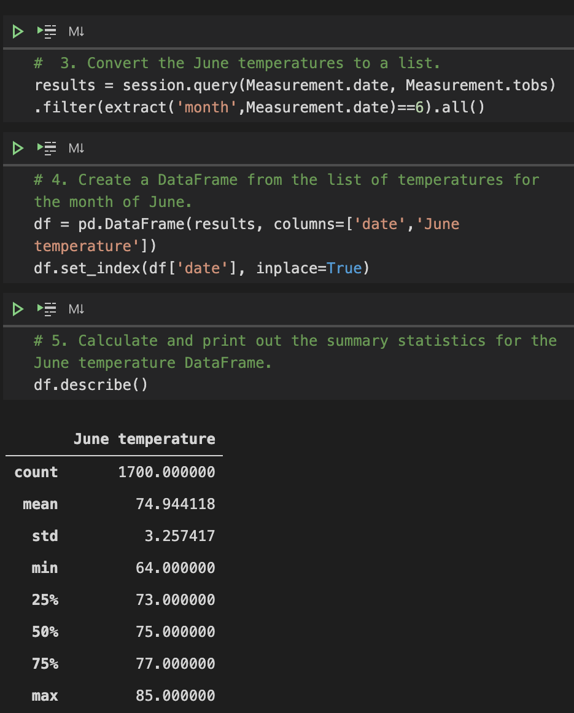

# Surfs Up

## Project Overview:
For this project, we were recruited to analyze weather data for an up and coming surf & ice cream shop in Oahu, Hawaii. In order to do that, we have to use tools to compile data for specific months/years to give to the investor. To do this we had to:
* Write a query that filters the Measurement table to retrieve the temperatures for the month of June
* Convert the June temperatures to a list.
* Create a DataFrame from the list of temperatures for the month of June. 
* Calculate and print out the summary statistics for the June temperature DataFrame.
* Repeat process for the month of December
* Create additional queries if needed
___
## Resources:

Data Source: Hawaii.sqlite file containing weather data for Hawaii.
Software: Jupyter Notebook, Virtual Studio Code, Flask, SQlite, SQLAlchemy
_____
## Results:

After calculating the results for both June and December, we can see some slight differences:
1. The minimum temperature difference is 8°f. June being 64°f and December being 56°f.
2. The maximum temperature difference is 2°f. June being 85°f and December being 83°f.
3. The average temperature difference is roughly 3°f. June being an average of 74.9°f and December being and average of 71°f.

## June Statistics:
 

## December Statistics: 

_____

## Summary:

As we can see from the data, the average and max temperatures for June and December are pretty close. Only the minimum temperature had the biggest difference from June and December, but it was a small gap. To further inspect to see the weather year-round, we ran two additional queries for March and September. Inspecting the temperatures on a 3 month interval can provide more insight on seasonal weather changes.

## March Statistics:

## September Statistics:

Our two additional queries have produced additional information about the overall yearly temperature. March is similar to December in terms of temperature, just being slightly colder. September is similar to June in terms of temperature, just being slightly warmer. 

In conclusion, the average temperature year-round doesn't drop below 70°f for either March, June, September, and December. This indicates that year-round, it wont be too cold for surfing and ice cream! 
